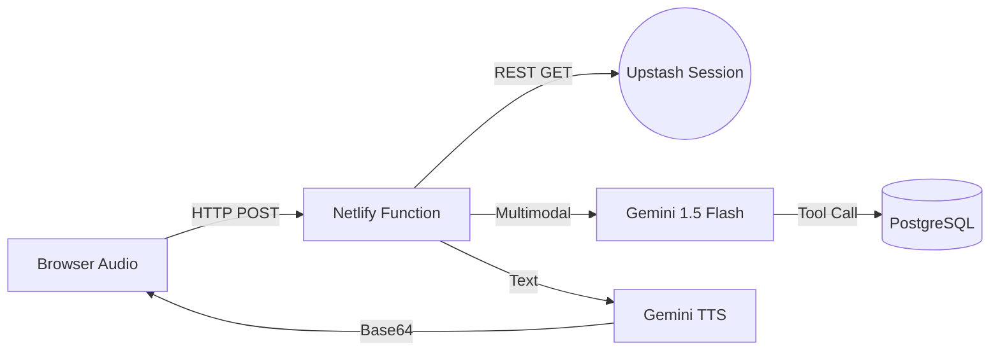

# Serverless Real-Time Voice AI Architecture

This system is designed for **stateless, low-latency execution** within Netlify's serverless environment. 

## 1. Top-Level Architecture

Unlike traditional long-lived WebSocket servers, this architecture uses an **Atomic Pipeline Pattern**. Every voice turn is treated as a discrete transaction.

- **Frontend**: Handles Audio Recording -> Chunking -> Base64 Encoding -> HTTP POST.
- **Backend (Netlify Functions)**: Orchestrates the AI pipeline.
- **Memory (External)**: Uses Upstash Redis (REST) for multi-turn session state and PostgreSQL (Neon/Supabase) for ACID-compliant scheduling.

## 2. The Atomic Pipeline

To achieve the sub-450ms latency target in a serverless environment, we collapsed the STT and LLM layers:

1.  **Request Entry**: Function receives `audio` + `sessionId`.
2.  **Context Injection**: Session history is fetched from Redis (cached per region).
3.  **Unified Multimodal Reasoning**:
    -   We pass the raw audio directly to **Gemini 1.5 Flash**.
    -   Gemini performs STT, Language Detection, and Intent Extraction in a **single inference pass**.
4.  **Tool Orchestration**: If a tool is requested (e.g., `bookAppointment`), the function executes the SQL query against the database.
5.  **Voice Synthesis**: Resulting text is passed to **Gemini TTS** (optimized for speed).
6.  **Response Exit**: Function returns the audio payload + transcription + metrics.

## 3. Data Flow Diagram

## 4. Latency Optimizations

- **Single Pass Inference**: By using multimodal Gemini, we eliminate the 150-200ms overhead of a separate Whisper/Deepgram call.
- **Serverless REST Redis**: Upstash's HTTP interface is faster than starting a fresh TCP connection for every function invocation.
- **Parallel Synthesis**: (In advanced versions) We can begin tool execution and secondary reasoning concurrently if the intent is clear.
- **Region Matching**: Deploy Netlify Functions in the same region as the database/Redis.
